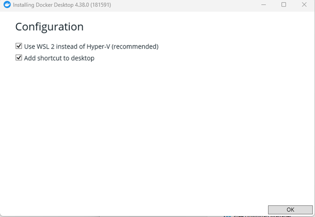
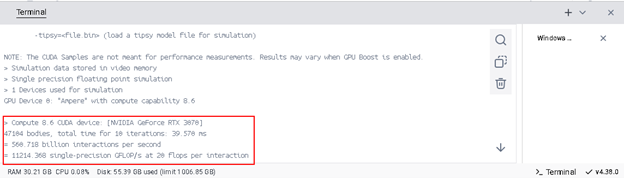
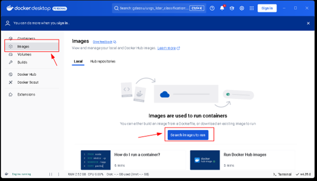
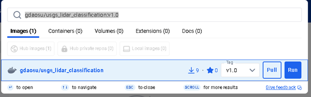
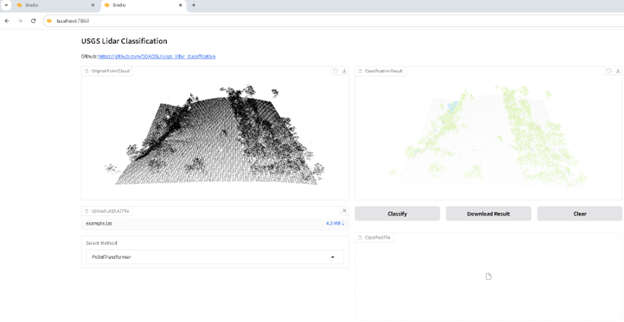

**Usage for Windows system:**

1. **Download and Install Docker Desktop**

    - Visit [Docker Desktop](https://www.docker.com/) and install the application.
        - 
        - 
    - Restart your system after installation.
    - Open **Docker Desktop**.
        - 

2. **Verify GPU Support in Docker**

    - Open **Terminal**.

    - Run the following command to check if Docker can detect your GPU:

        ```
        docker run --rm -it --gpus=all nvcr.io/nvidia/k8s/cuda-sample:nbody nbody -gpu
        ```

    - If the output shows GPU computation, your setup is working correctly.

        - 
        - Reference: [Docker GPU Support](https://docs.docker.com/desktop/features/gpu/).

3. **Download the USGS LiDAR Point Cloud Classification Tool Docker Image**

    ​	

    - Pull 'gdaosu/usgs_lidar_classification:v1.0'

        

4. **Run the Application**

    - **Do not use the "Run" button in Docker Desktop GUI**, as it does not support GPU.

    - Instead, open **Terminal** and run:

        ```
        docker run --gpus "all" -p 7860:7860 -it gdaosu/usgs_lidar_classification:v1.0
        ```

5. **Access the Tool**

    - Open your browser and visit:

        ```
        http://localhost:7860
        ```

    - You should now be able to use the software.

        - 

