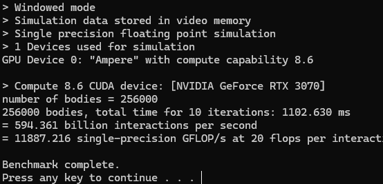
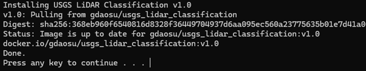
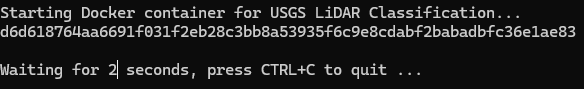
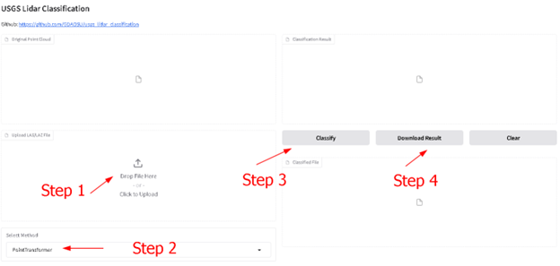
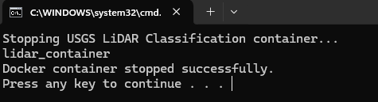

### **Usage for Windows System**

**Note: All the used .bat files are located in the win_bat directory.**

1. **Download and Install Docker Desktop**
    - Visit [Docker Desktop](https://www.docker.com/) and install the application.
        
        
    - Restart your system after installation.
    - Open **Docker Desktop**.
    
        
2. **Check Docker Installation and GPU Capacity**
    - Run `check_docker_gpu.bat` to verify that Docker is installed correctly and detect GPU support.
    - You should see an output similar to the following if your GPU is detected successfully.
        
3. **Install the Docker Image** *(One-time setup)*
    - Execute `install_win.bat` to download and install the necessary Docker image.
    - **Note:** This step only needs to be performed **once** unless a reinstallation is required.
        
4. **Start the USGS LiDAR Classification Software**
    - Run `start_win.bat` to start the software.
    - Wait for the browser to automatically open the application interface.
        
        
        
5. **Stop the Program**
    - To safely stop the program, execute `stop_win.bat`.
    - The shutdown process may take approximately **10 seconds** to complete.
        